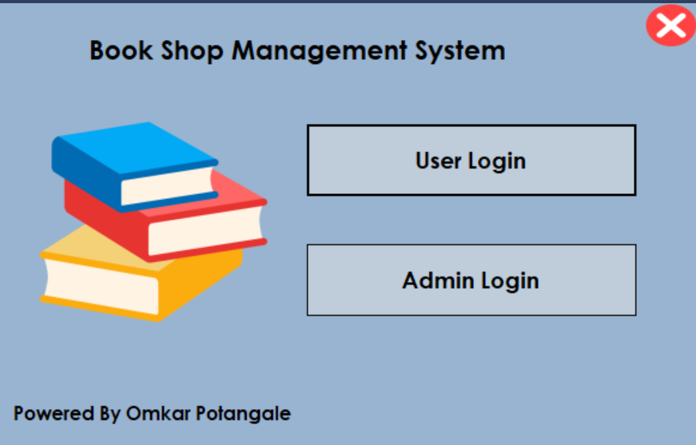
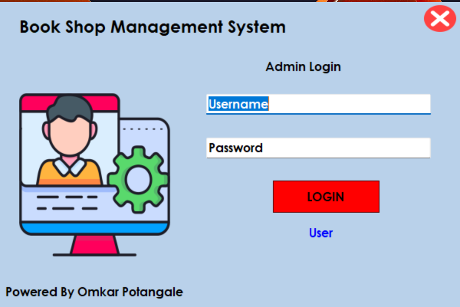
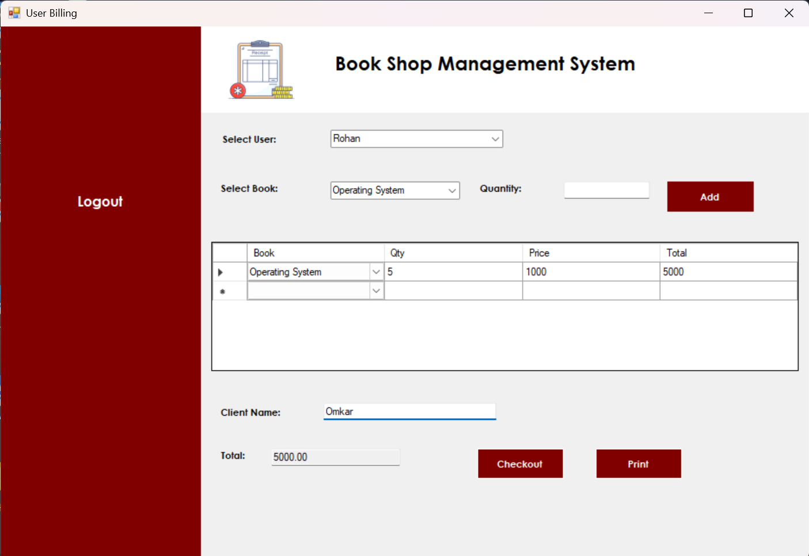
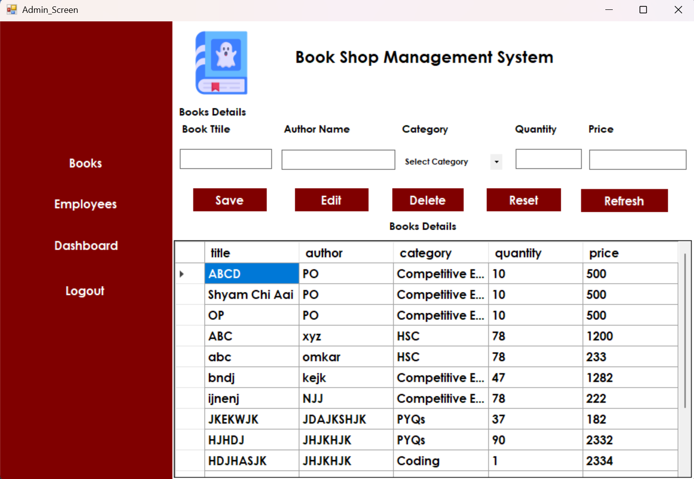
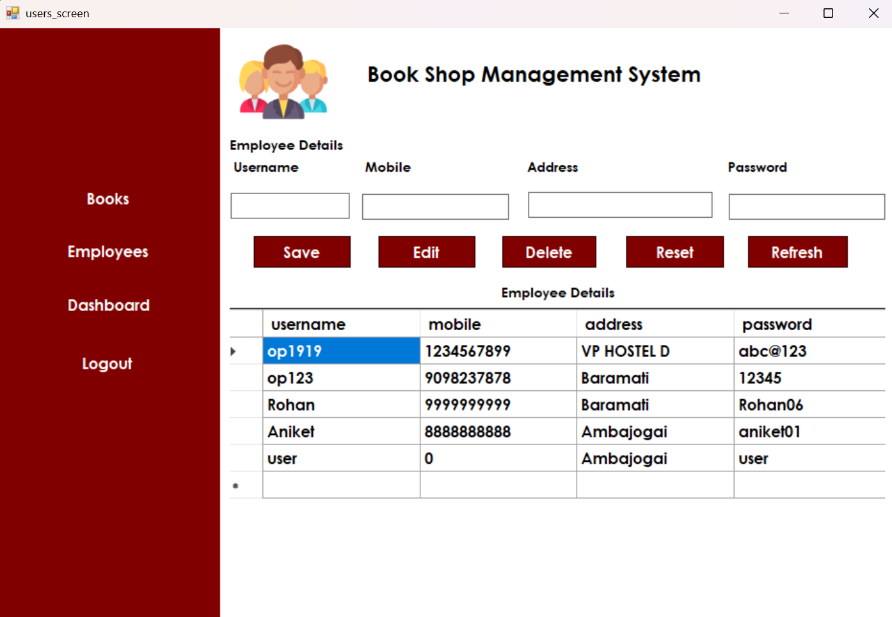
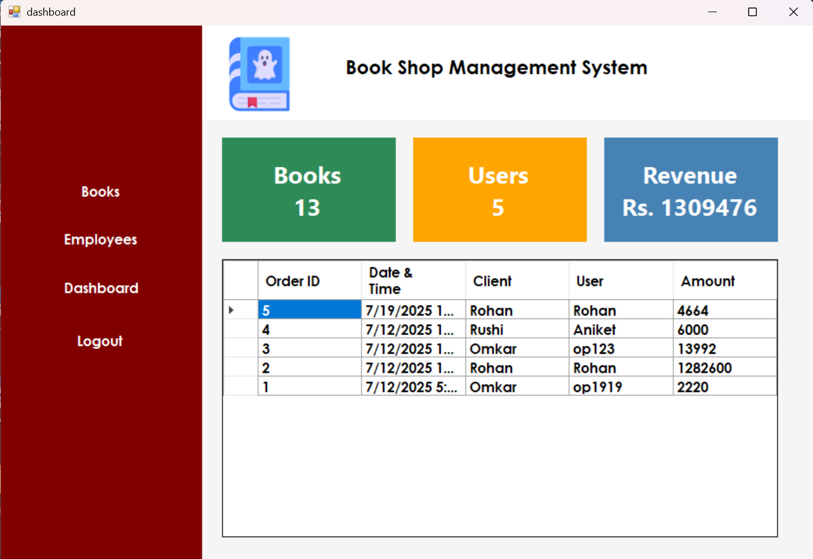

# 📚 Book Store Management System

A simple Windows Forms application built using **C# (.NET Framework)** and **MySQL** that allows managing books, users, and user billing in a bookstore.

---

## 🛠️ Technologies Used

- **Frontend:** Windows Forms (WinForms)
- **Backend:** C# (.NET Framework)
- **Database:** MySQL
- **IDE:** Visual Studio

---

## 🧠 Features

- ✅ Admin Dashboard to manage books
- ✅ User login system
- ✅ Add and view book details
- ✅ Checkout with billing system
- ✅ Save transactions with:
  - Client name
  - Username
  - Total amount
  - Date and Time

---

## 📸 Screenshots

<div align="center">

<table>
  <tr>
    <td></td>
    <td></td>
  </tr>
  <tr>
    <td></td>
    <td></td>
  </tr>
  <tr>
    <td></td>
    <td></td>
  </tr>
</table>

</div>

---

## 🗃️ Database Structure

### Database Name: `bsms`

#### 📘 `books` Table
| title | author | category | quantity | price |

#### 👤 `users` Table
| username | mobile | address | password |

#### 💳 `transactions` Table
| order_id (auto) | date_time | client_name | username | total_amount |

---

## 🚀 Getting Started

1. **Clone the project or download ZIP**
2. **Open** `.sln` file in Visual Studio
3. **Configure MySQL Connection**
   - Go to `users_billing.cs`
   - Update this line with your password if needed:
     ```csharp
     MySqlConnection con = new MySqlConnection("server=localhost;user id=root;password=;database=bsms");
     ```
4. **Create the database and tables** (if not already)
5. **Run the project** (`F5` or Start)

---

## 📌 Notes

- This is a beginner-friendly project made for learning purposes.
- You can extend it by adding:
  - Report printing
  - Admin reports
  - Inventory control

---

## 📃 License

Free to use and modify for learning or educational purposes.

---

# 👨‍💻 Author

**Omkar Potangale**

🔗 Portfolio  
https://omkarpotangale.tech/

📧 Email  
omkarpotangale@gmail.com  

🔗 LinkedIn  
https://www.linkedin.com/in/omkarpotangale/
